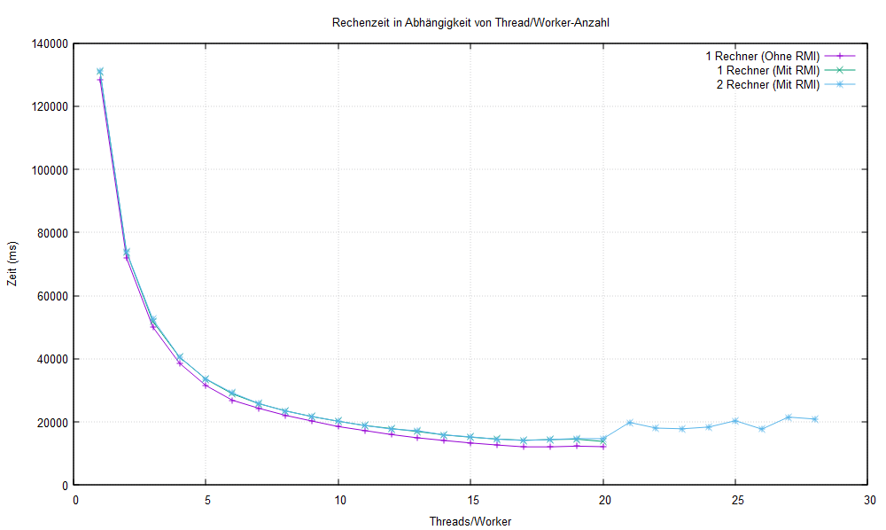

# vs-Beleg-ATEG
Belegarbeit für Verteilte Systeme von: Ahmad Ali Nabizada, Tobias Kroll, Eric Hübel, Georg Richter

Start für Funktionsfähige Berechnung:
1. ./runServer.sh 
2. Für alle Worker (default 4) ./runWorker.sh <Adresse des Servers>
3. ./runGui.sh und auf "Start!" klicken, ggf Parameter verstellen

-> dasselbe gilt für Windows nur hier müssen die .bat-Skripte aufgerufen werden

Das Klassenmodel ist in UML_Klassendiagramm.puml gespeichert.

Wir haben die Implementierung und Aufgaben wie folgt aufgeilt:
Eric: Implementierung der GUI
Ahmad: Implementierung des Controllers und Erstellung des BootstrapServers mit Georg
Georg: Implementierung der Worker, Planung der Projektarbeit
Tobias: Implementierung der PixelBerechnung

Genauere Beschreibung in Dokumentation.md

# Messwerte

- alle Tests unter Windows 10, Linux ist tatsächlich langsamer

## 1 Rechner mit i5-13500@4GHz **ohne RMI** (nur mit Thread-Verteilung)

| Threads | Zeit (ms) |
|---------|-----------|
| 1       | 128484    |
| 2       | 71899     |
| 3       | 49995     |
| 4       | 38589     |
| 5       | 31506     |
| 6       | 26849     |
| 7       | 24274     |
| 8       | 22070     |
| 9       | 20276     |
| 10      | 18493     |
| 11      | 17236     |
| 12      | 15969     |
| 13      | 14939     |
| 14      | 14090     |
| 15      | 13319     |
| 16      | 12671     |
| 17      | 12078     |
| 18      | 12067     |
| 19      | 12294     |
| 20      | 12128     |

## 1 Rechner mit i5-13500@4GHz **mit RMI**

| Worker  | Zeit (ms) |
|---------|-----------|
| 1       | 130938    |
| 2       | 73720     |
| 3       | 51763     |
| 4       | 40502     |
| 5       | 33525     |
| 6       | 28853     |
| 7       | 25747     |
| 8       | 23492     |
| 9       | 21677     |
| 10      | 20173     |
| 11      | 18833     |
| 12      | 17889     |
| 13      | 16940     |
| 14      | 15855     |
| 15      | 15138     |
| 16      | 14548     |
| 17      | 14168     |
| 18      | 14372     |
| 19      | 14521     |
| 20      | 13777     |

## 2 Rechner mit i5-13500@4GHz und i5-1035G1@3GHz **mit RMI über WLAN**

| Worker (Lokal+Remote)  | Zeit (ms) |
|------------------------|-----------|
| 1+0                    | 131207    |
| 2+0                    | 73853     |
| 3+0                    | 52454     |
| 4+0                    | 40623     |
| 5+0                    | 33609     |
| 6+0                    | 29155     |
| 7+0                    | 25806     |
| 8+0                    | 23440     |
| 9+0                    | 21705     |
| 10+0                   | 20195     |
| 11+0                   | 18848     |
| 12+0                   | 17723     |
| 13+0                   | 17169     |
| 14+0                   | 15861     |
| 15+0                   | 15230     |
| 16+0                   | 14520     |
| 17+0                   | 14095     |
| 18+0                   | 14414     |
| 19+0                   | 14717     |
| 20+0                   | 14642     |
| 20+1                   | 19821     |
| 20+2                   | 18012     |
| 20+3                   | 17788     |
| 20+4                   | 18362     |
| 20+5                   | 20340     |
| 20+6                   | 17687     |
| 20+7                   | 21517     |
| 20+8                   | 20885     |